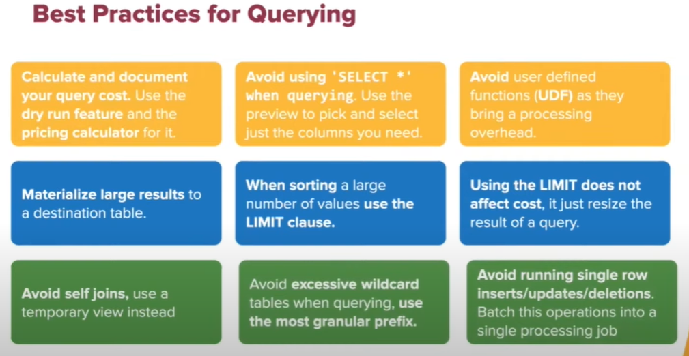
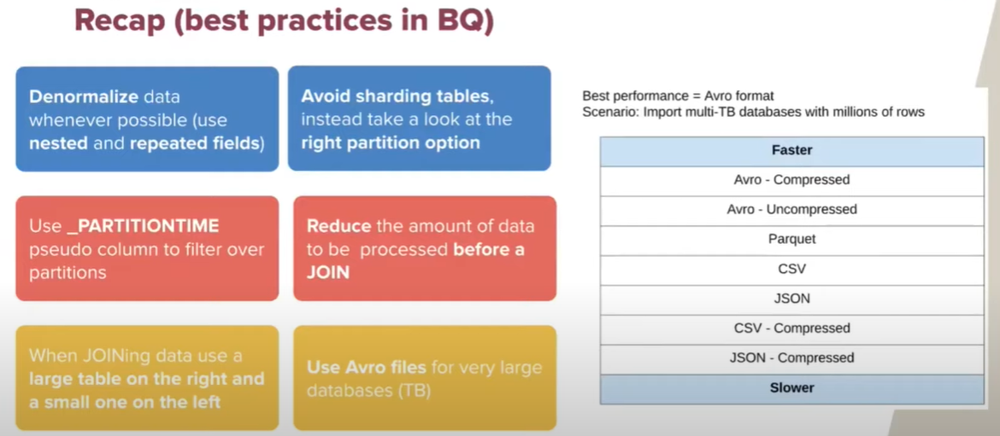

# BigQuery

## Dremel

Dremel is a distributed system developed at Google for interactively querying large datasets.

Dremel is the query engine used in Google's BigQuery service.

Dremel is the inspiration for Apache Drill, Apache Impala, and Dremio, an Apache licensed platform that includes a distributed SQL execution engine.

## Best Practice for BQ

