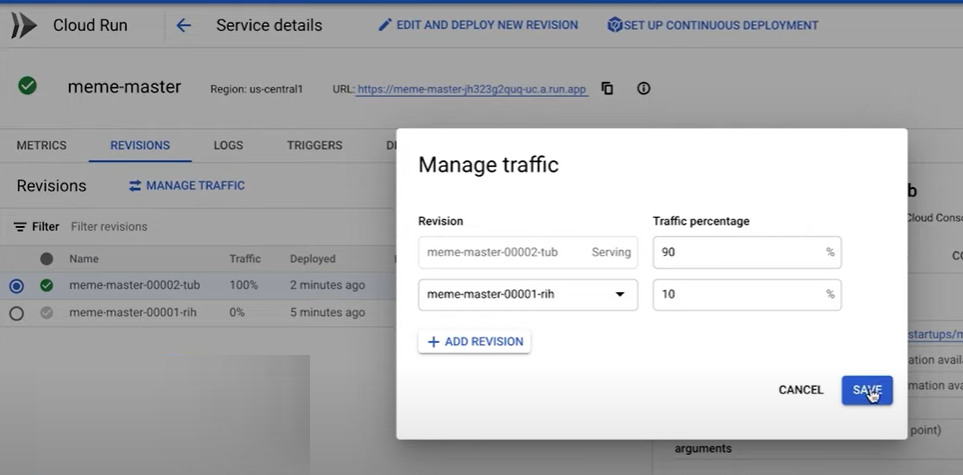

# Cloud Run

<!-- https://www.youtube.com/watch?v=rVWopvGE74c&list=PLIivdWyY5sqJOQJCXW_aYEqwfyi6bu1gC&index=3 -->

## GCP Serverless options

Cloud Run

## Cloud Run demo

<!-- https://github.com/as-a-service/meme -->

## Performance optimization

![1672605551970](image/GCP_CloudRun/1672605551970.png

## Cost optimization

