# GCP Cloud SQL

## Demo

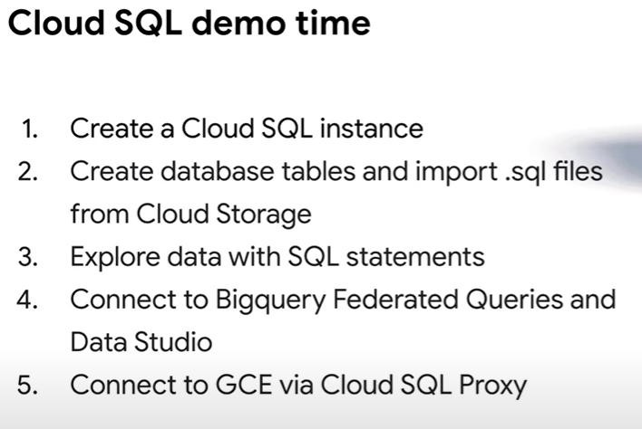

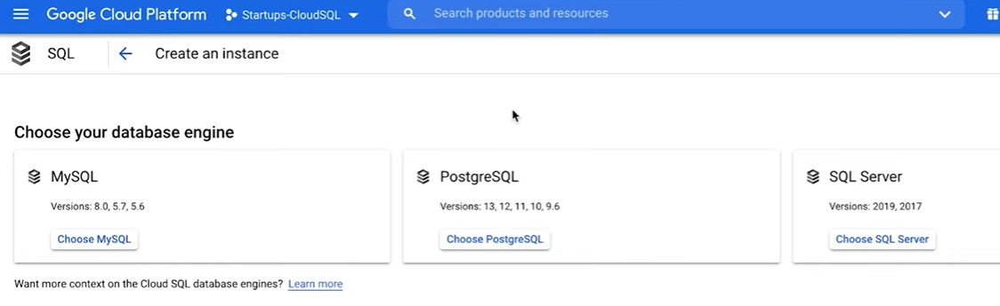

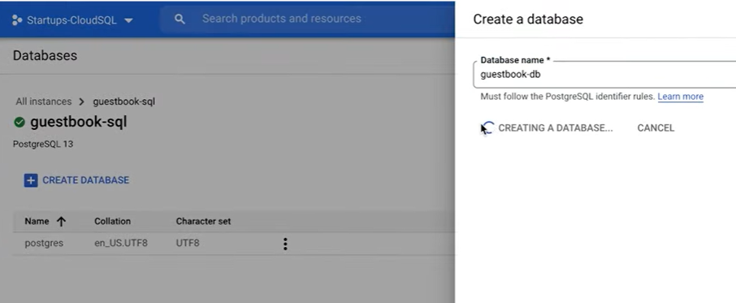

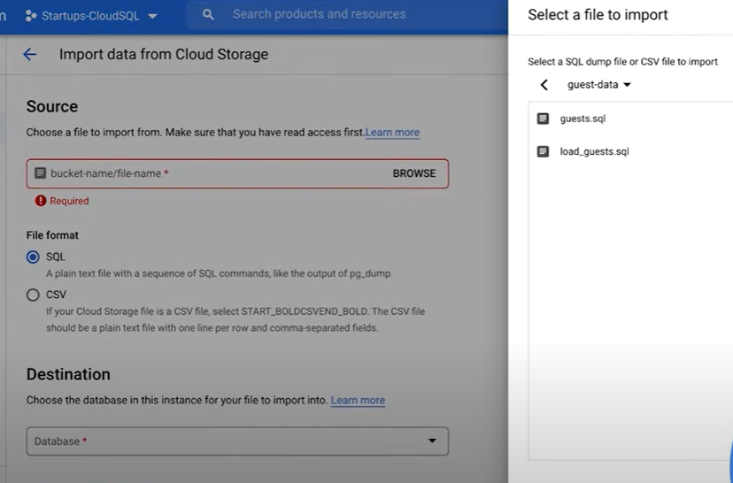

Use 2 SQL scripts: 1 for create tables, and 1 for populating data to the tables.

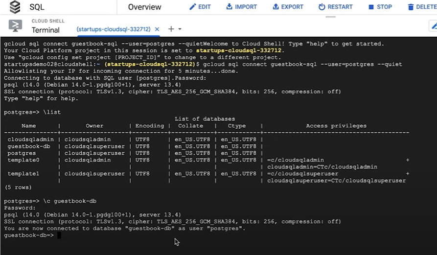

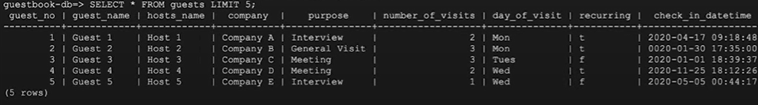

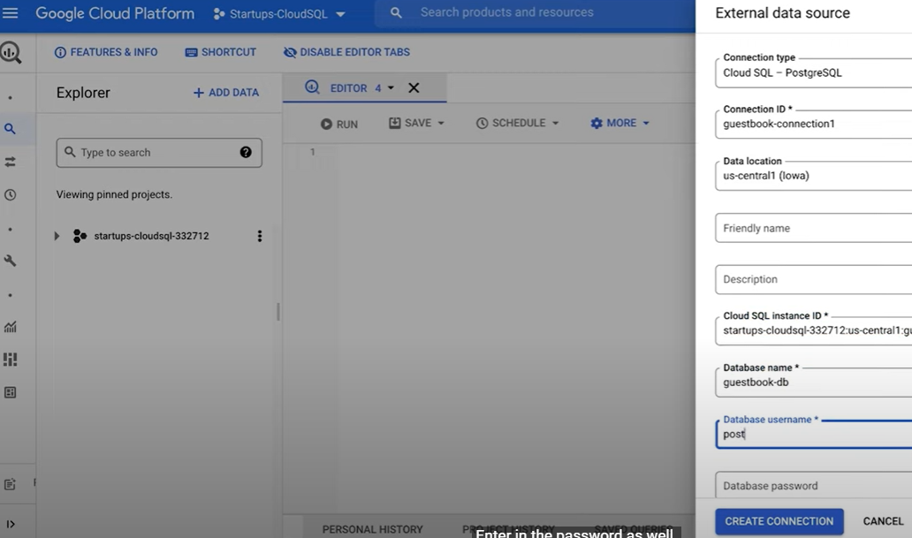

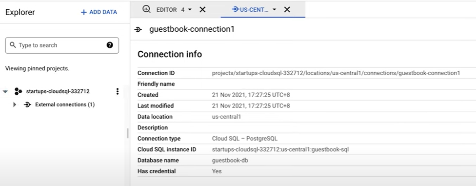

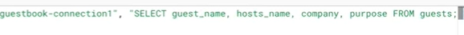

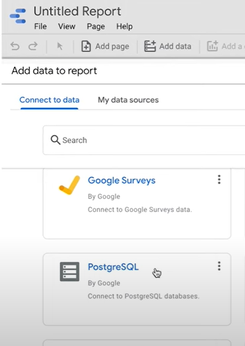

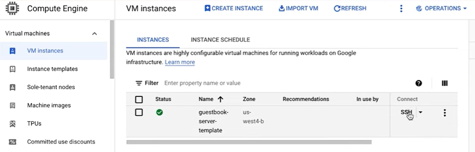

Download the Cloud SQL auth proxy

Install the PostgreSQL client

Start PostgreSQL auth proxy

Connect to the PostgreSQL client

Use it to query PostgreSQL

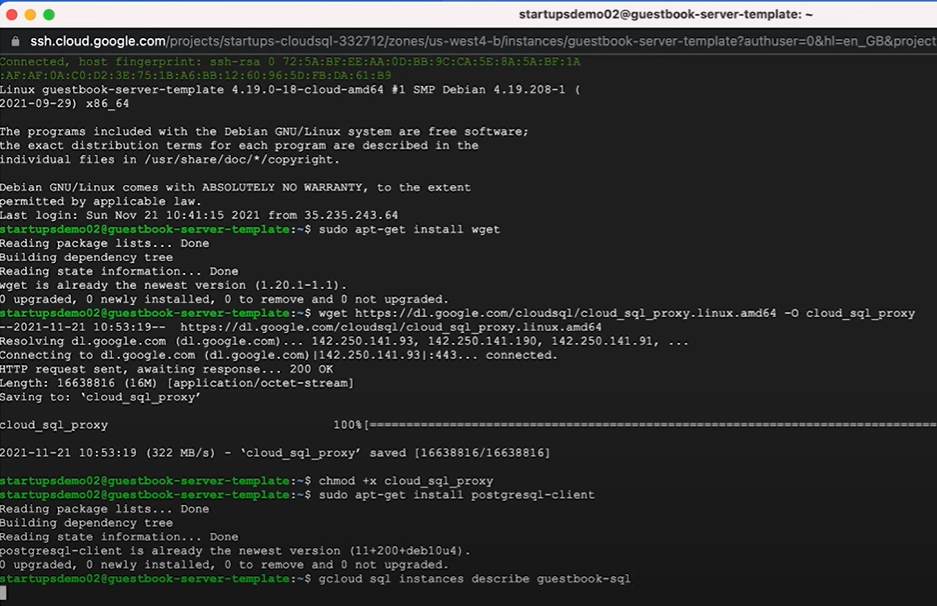

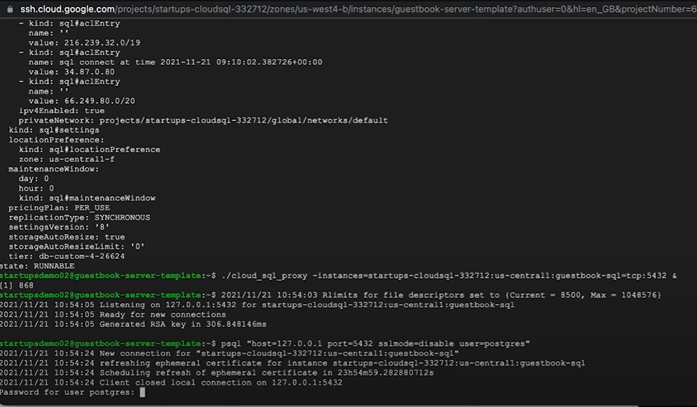

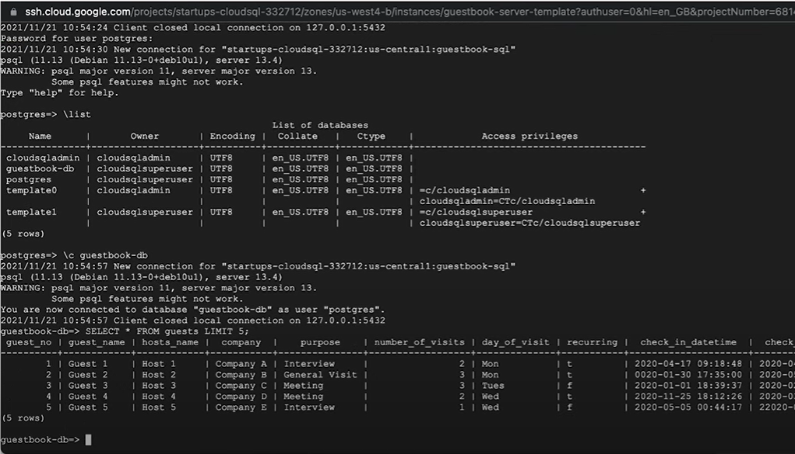

## Performance Optimization for Cloud SQL

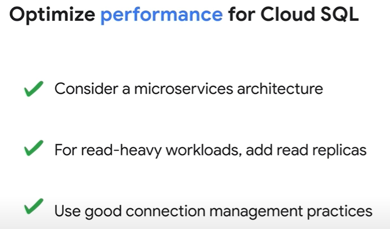

HAProxy

Exponential backup and connection pooling

## Cost Optimization for Cloud SQL

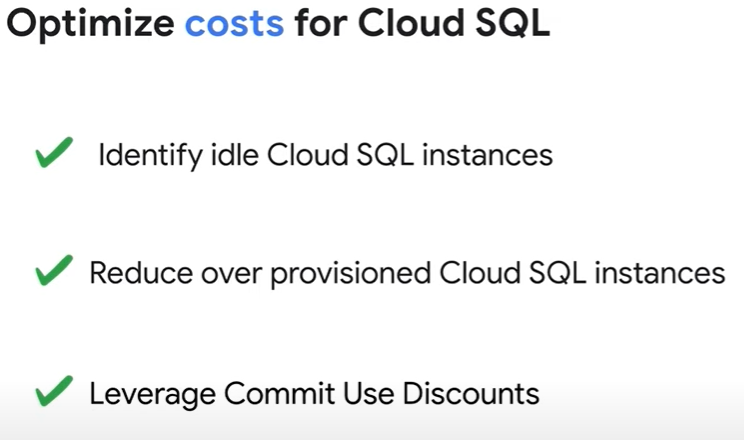
