# Firebase

<!-- https://www.youtube.com/watch?v=zEWMa-yJQmg&list=PLIivdWyY5sqJOQJCXW_aYEqwfyi6bu1gC&index=8 -->

Firebase is a suite of tools for building apps on top of Google Cloud Platform. It's most famous for its realtime database, but also includes services for user authentication, serverless computing, push messaging, file storage, and more. <https://fireship.io/pro>

## Info

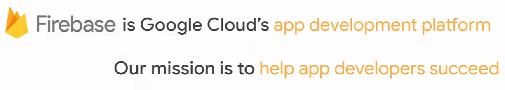

Firebase supports these -

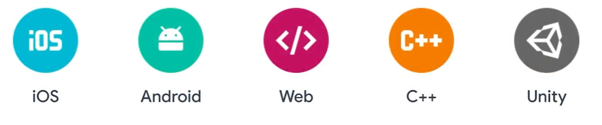

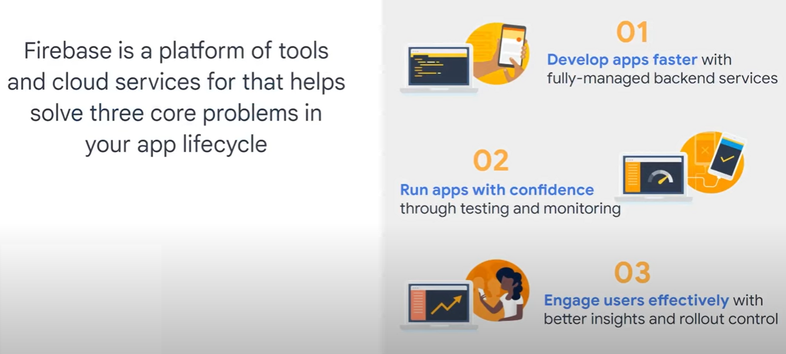

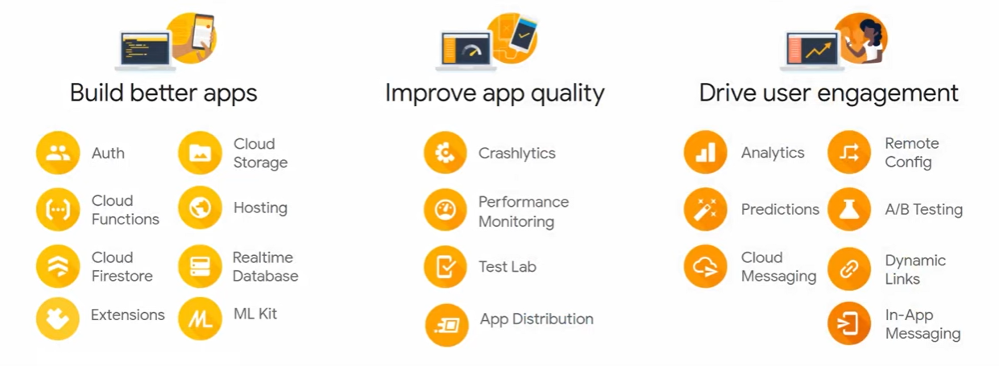

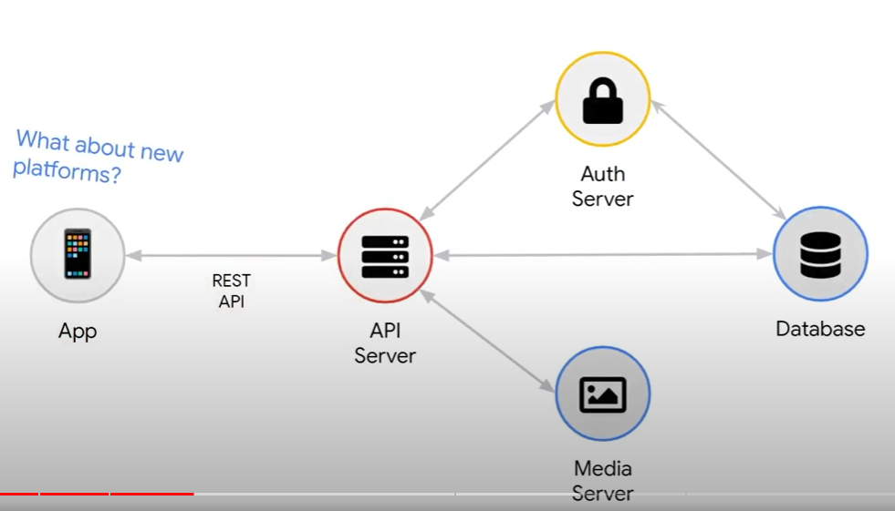

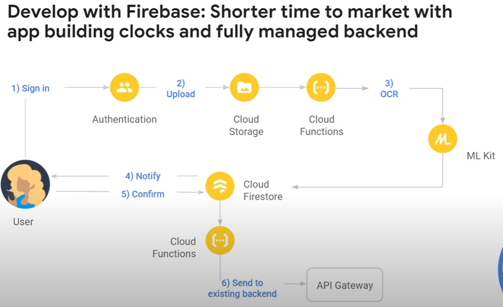

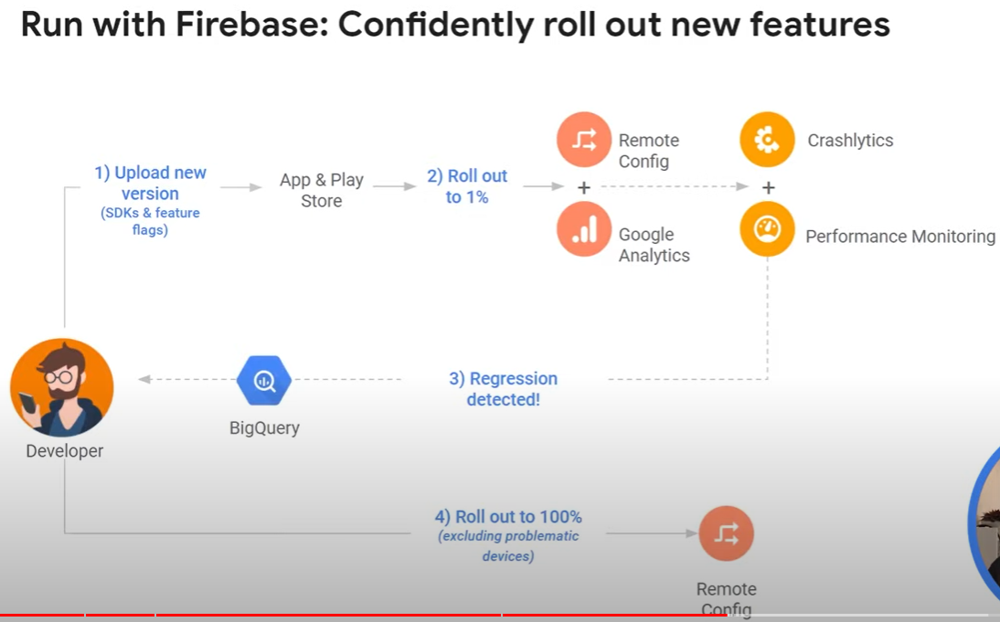

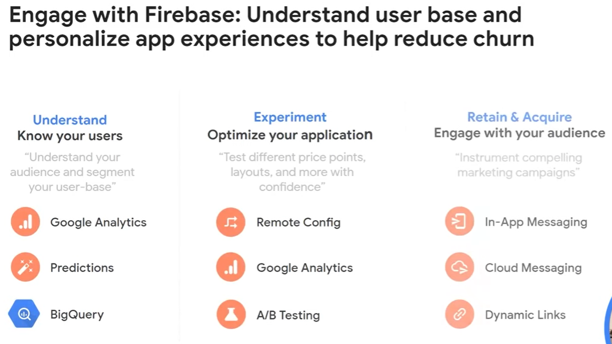

## Use case

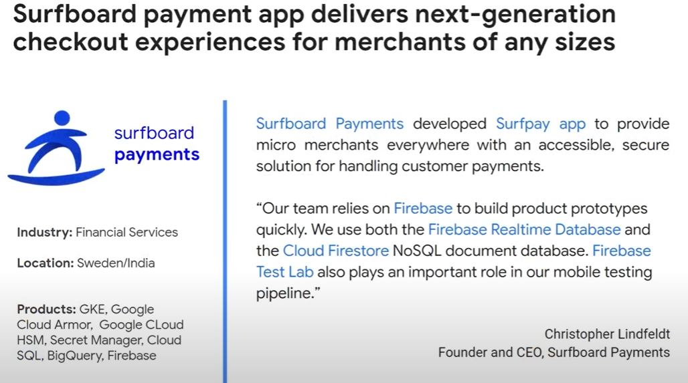

## How to connect the Android app to Firebase

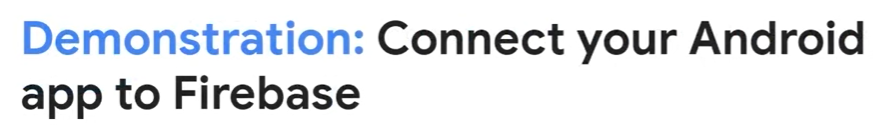

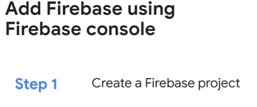

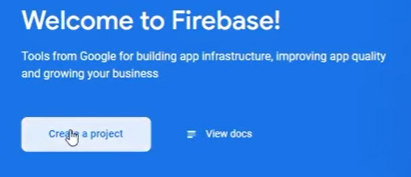

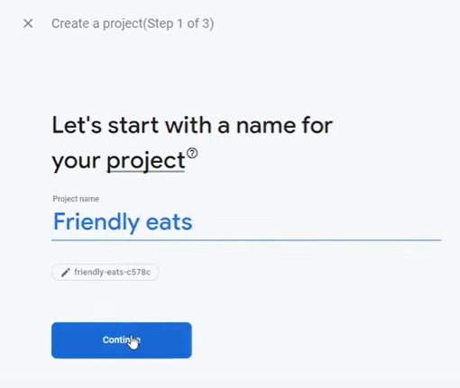

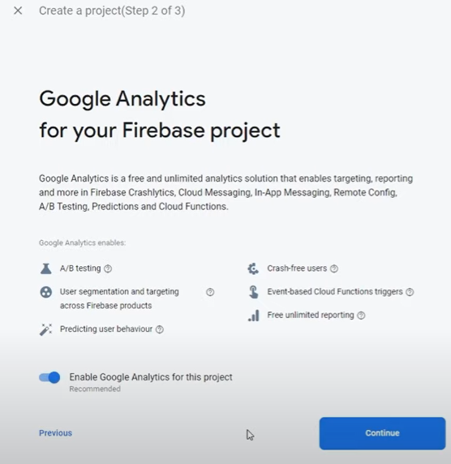

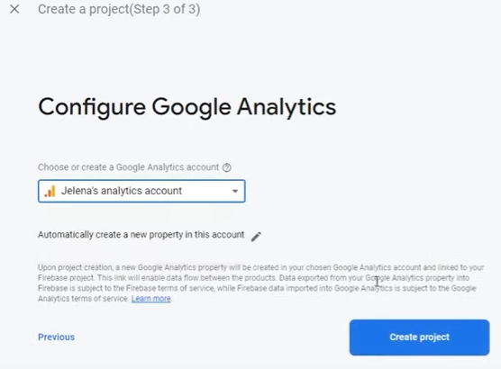

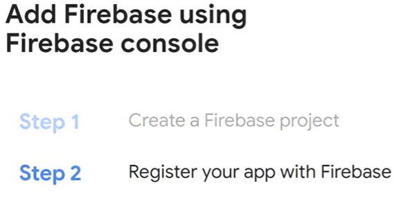

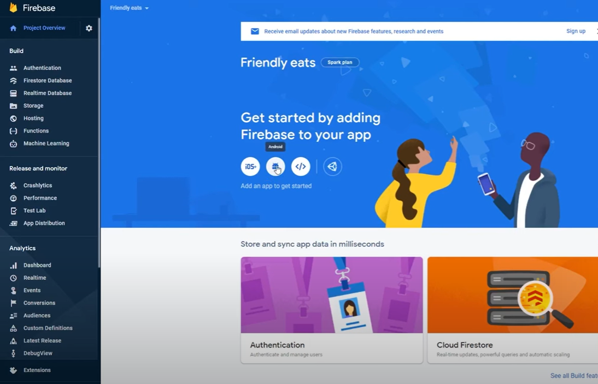

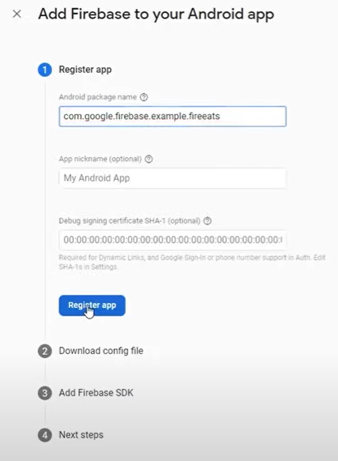

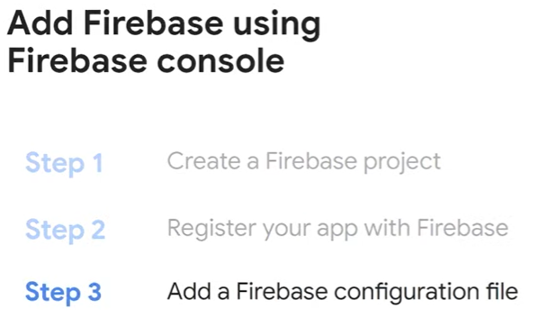

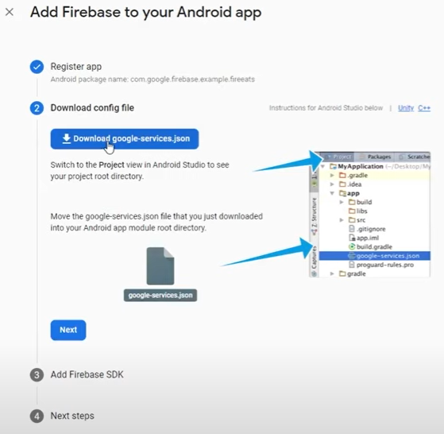

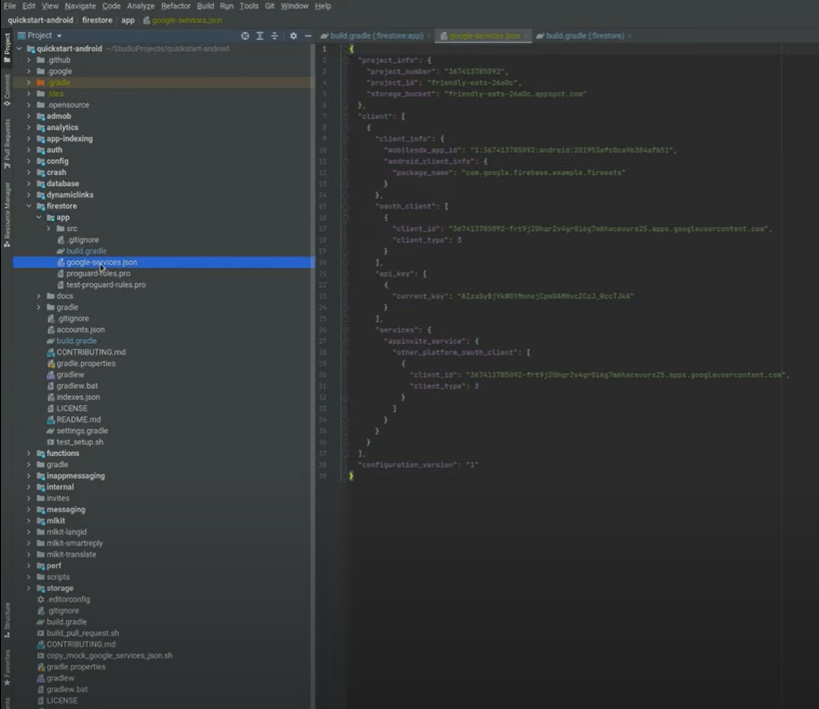

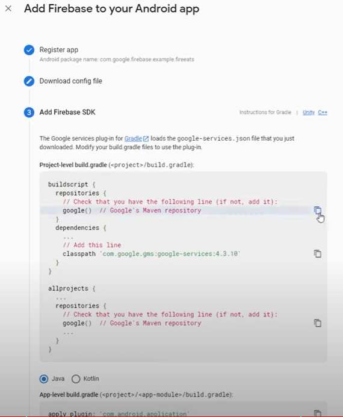

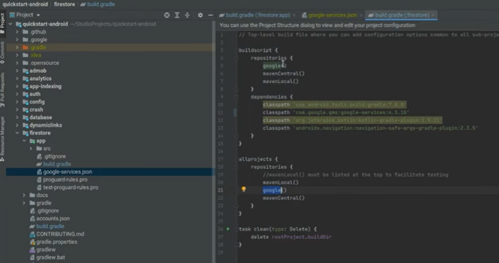

Plugin

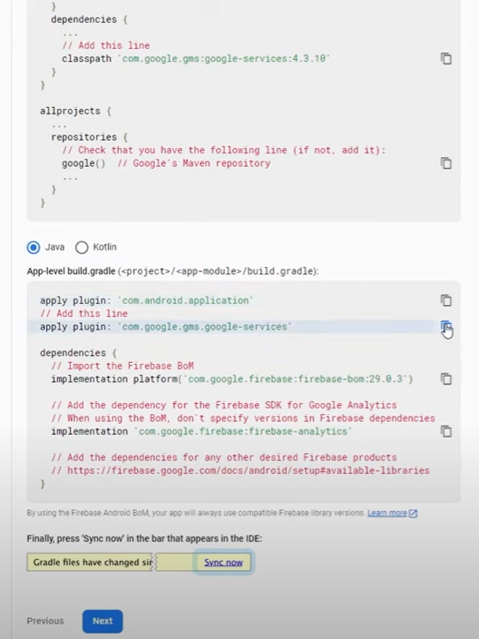

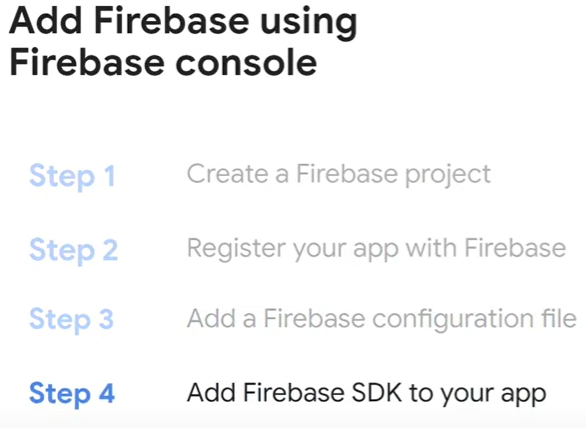

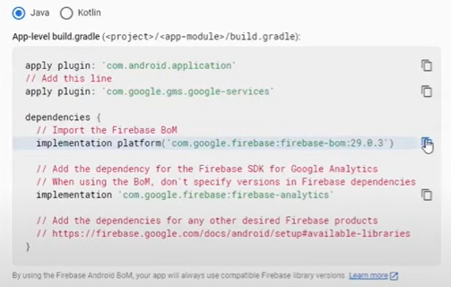

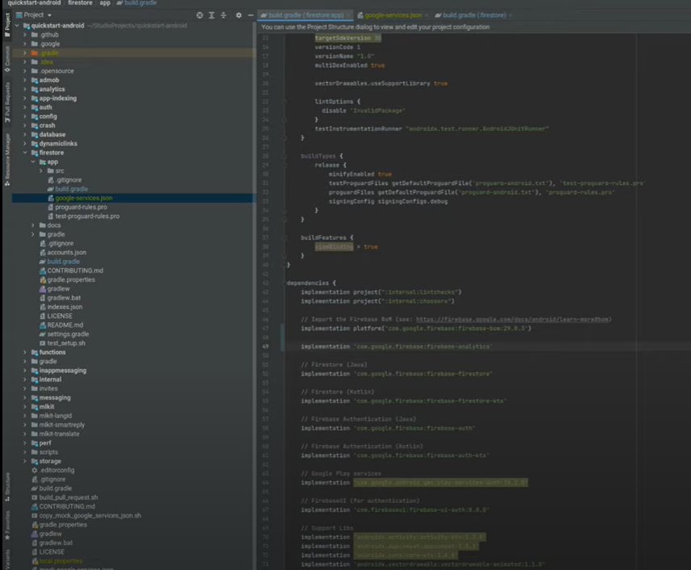

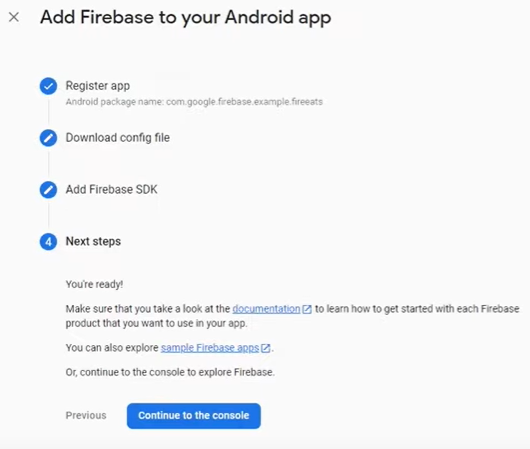
