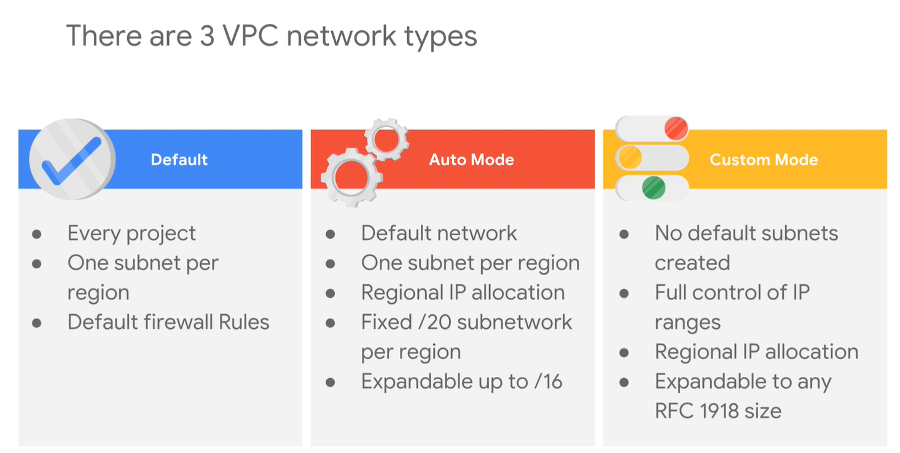
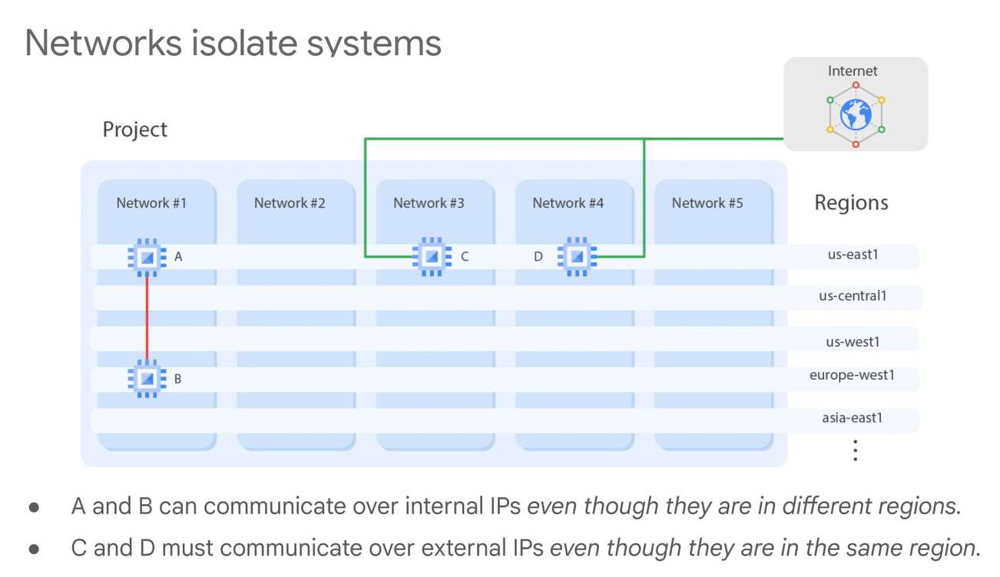
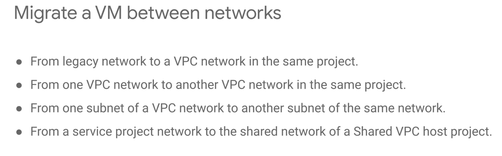
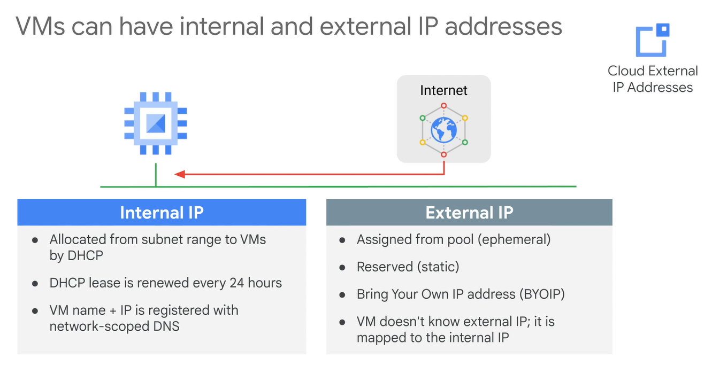
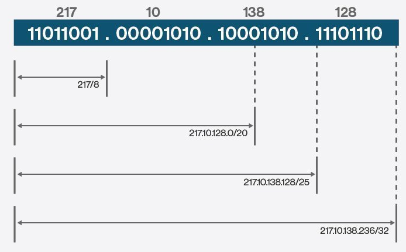
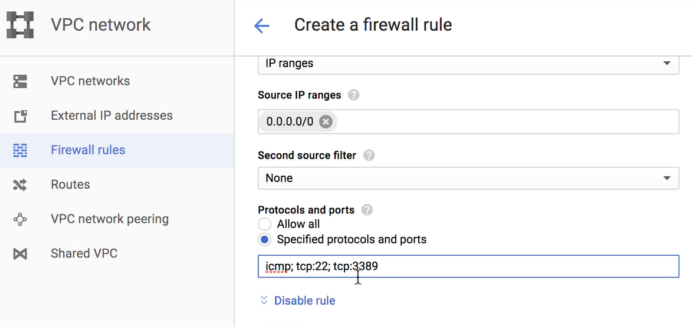
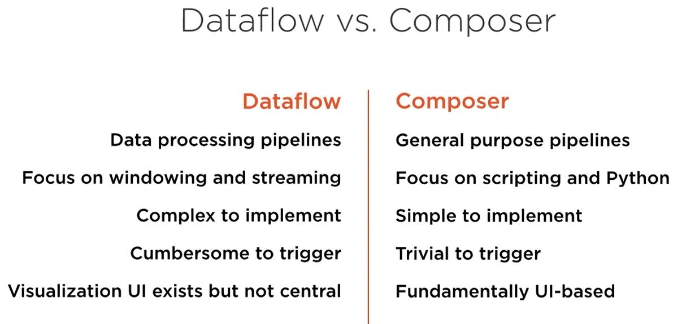

# GCP networks

## IP Addresses for Default Domains

Google publishes the complete list of IP ranges that it announces to the internet in goog.json.

Google also publishes a list of Google Cloud customer-usable global and regional external IP addresses ranges in cloud.json.

The following files replace the \_spf.google.com TXT records previously recommended to use for listing Google IP addresses.

- https://www.gstatic.com/ipranges/cloud.json provides a JSON representation of Cloud IP addresses organized by region.
- https://www.gstatic.com/ipranges/cloud_geofeed is a standard geofeed formatted IP geolocation file that we share with 3rd-party IP geo providers like Maxmind, Neustar, and IP2Location.
- https://www.gstatic.com/ipranges/goog.json and https://www.gstatic.com/ipranges/goog.txt are TXT and JSON formatted files respectively that include Google public prefixes in CIDR notation.

For more information as well as an example of how to use this information, refer to https://cloud.google.com/vpc/docs/configure-private-google-access#ip-addr-defaults

## CIDR

CIDR (Classless Inter-Domain Routing) -- also known as supernetting -- is a method of assigning Internet Protocol (IP) addresses that improves the efficiency of address distribution and replaces the previous system based on Class A, Class B and Class C networks.

## Firewall rules

Example

## Dataflow vs Composer

