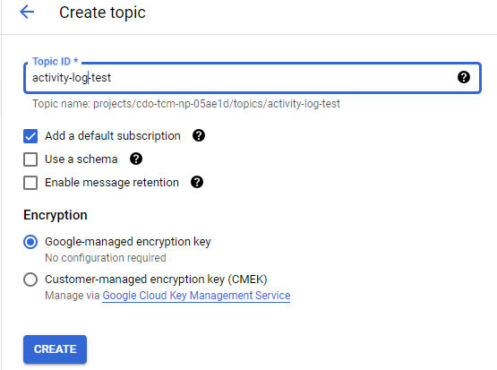
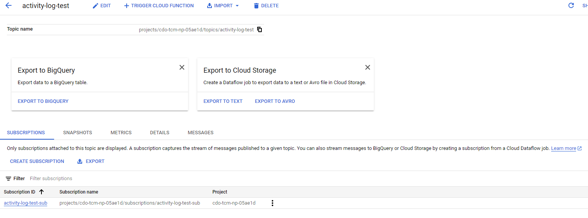
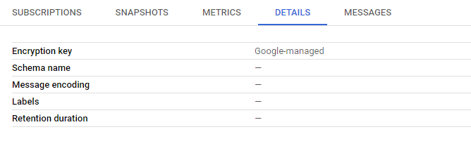
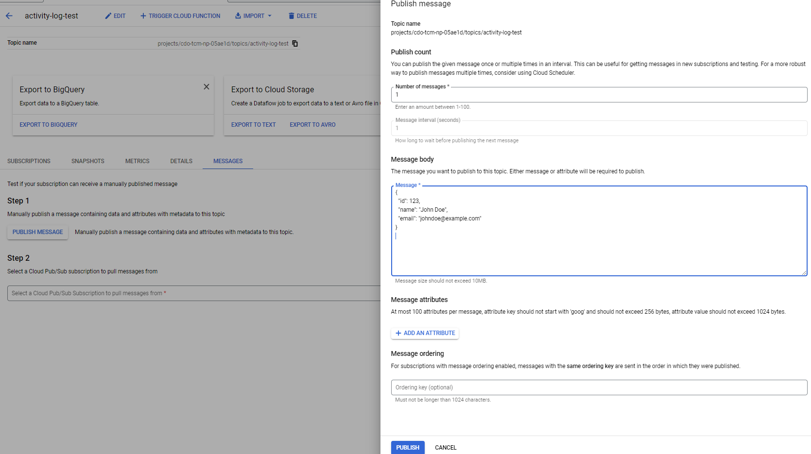
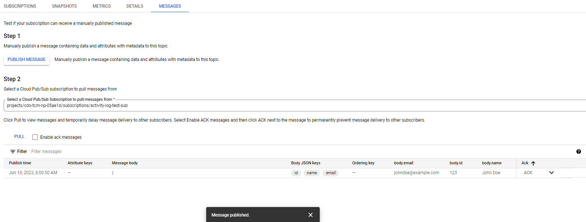

# GCP PubSub

## Using GCP console

### 1. Login GCP console

Choose the right GCP project

Go to Pub/Sub -> Topics

### 2. Create a Topic and a Subscription

Topic: activity-log-test

Subscription: activity-log-test-sub

Details:

### 3. Verify with a test message

