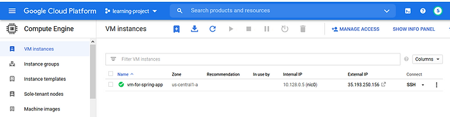
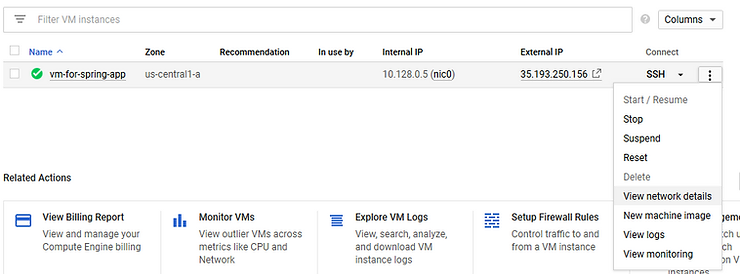
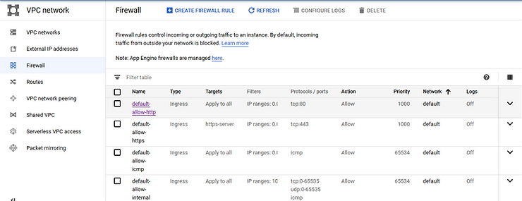
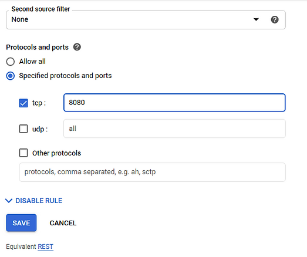

# My GCP Solutions

## How to depoply a Spring Boot app to GCP

There are 3 ways to deploy and run an Spring Boot app on GCP.

### Spring Boot app to GCP GCE (vm) [Not recommended]

Google Compute Engine is Infrastructure  as a Service (IaaS), which allows us to Create VM, allocate Memory, CPU, and Storage (SSD, HDD).

### Steps

1. Create a new Virtual Machine

Set the Ubuntu OS with the N1 Standard Machine type with 4 GB of memory.

2. SSH into the VM by clicking on the SSH button

3. Update the Ubuntu software packages

`$ sudo apt-get update`

4. Installing the Java 8 on Ubuntu VM

`$ sudo apt-get install openjdk-8-jdk`

5. Now, Clone the Spring App from Github

`$ git clone <https://github.com/infiprotonblog/hello-world-spring-boot-app.git>`

6. Change the directory to Spring App

`$ cd hello-world-spring-boot-app/springapp/`

7. Grant the permission to ./mvnw ( maven wrapper ) to run on the VM

`$ chmod +x ./mvnw`

8. Building the Spring Boot App

`$ ./mvnw package`

9. Change the directory to the target

`$ cd target`

10. Now, Run the Spring Boot App as the background process in the VM

`$  nohup java -jar springapp1-0.0.1-SNAPSHOT.war &`

11. Expose 8080 port on the VM to make the Spring App accessible to the Internet

- Select View Network details

- Go to Firewall Settings

- Go to default-http-server and click on the edit button

- Add the 8080 port to the TCP and click the Save button to make the changes

12. Verify that Spring Boot App is running

### Pros of using GCP GCE (vm) to deploy a Spring Boot app

GCE is popular with small business applications

Cost less compared to GAE

GCE provides the full infrastructure in the form of VM that we have control over it

GCE allows us to use container optimized OS to run docker containers

### Cons of using GCP GCE (vm) to deploy a Spring Boot app

VM requires at least one instance to run constantly

Need to manage Application and Virtual Machine regularly

Auto Scaling is Slower than Google App Engine

High Expensive as we need someone to manage VM and install everything for running Application
