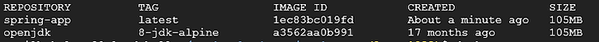

# My GCP Solutions

## How to depoply a Spring Boot app to GCP

There are 3 ways to deploy and run an Spring Boot app on GCP.

### Spring Boot app to GCP GKE [Recommended]

Google Kubernetes Engine is formerly known as Container Engine. It takes care of provisioning and maintaining the Cluster Virtual Machines, Scaling our applications.

### Steps to deploy a Spring Boot app to GCP GKE

1. Create a Kubernetes Cluster

2. Open the Google Cloud Shell

3. Clone the Spring App project in Cloud shell

`$ git clone https://github.com/infiprotonblog/hello-world-spring-boot-app.git`

4. change the directory to Spring App

`$ cd spring-boot-app/springapp/`

5. Build the Docker-image for Spring App

`$ docker build -t <user-name>/<tag-name> <location-of-dockerfile>`

`$ docker build -t sunilbvb/spring-app .`

6. Check the images, we just built

`$ docker images`



7. Run the Spring App Docker image locally in the Cloud shell

`$ docker run -d -p <port>:<port> <image-name>`

`$ docker run -d -p 8080:8080 spring-app`

8. Check the App is running by clicking on Web Preview on the port 8080


### Spring Boot app to GCP GAE [Not recommended]

Google App Engine is a Platform as a Service and cloud computing platform for developing and hosting web applications.

Google App Engine supports Standard and Flexible environment, and the Flexible environment is the best option for deploying the Spring Boot application.

With the AppEngine Flex Environment, we are not restricted to the Jetty web framework to run the web applications. So there is no need to tweak Spring Boot dependencies to run in the GAE any more.

### Steps to deploy a Spring Boot app to GCP GAE

1. Go to Google App Engine, Click on the Create Application button, select Region, and click Create an app

2. Select the Programming Language on which we are deploying the App and select Environment as Flexible

3. Deploy to App Engine using Google's Cloud Shell

4. Clone the Project

`$ git clone https://github.com/infiprotonblog/hello-world-spring-boot-app.git`

5. Change the directory to Spring App

`$ cd hello-world-spring-boot-app/springapp/`

6. Create an appengine folder in the main directory: src/main/appengine/

`$ mkdir src/main/appengine/`

7. Create an app.yaml file inside the appengine folder

`$ vim app.yml`

or nano, vi etc.

8. Add the below contents to it

```yml
#app.yml file src/main/appengine

runtime: java
env: flex

env_variables:
SPRING_PROFILES_ACTIVE: "cloud-gcp"

handlers:  
- url: /.*
script: this field is required, but ignored
secure: always
manual_scaling:
instances: 1

resources:
cpu: 2
memory_gb: 2.3
disk_size_gb: 10
```

9. Set the configuration to the Google App Engine project

`$ gcloud init`

10. Change the directory to the appengine, so we can deploy the App using the app.yml file

`$ cd src/main/appengine/`

11. Deploy to Google App Engine using the below command

`$ gcloud app deploy`

12. Verify that the Application is running

`$ https://learn1233.uc.r.appspot.com/hello`


### Pros of using GCP GAE to deploy a Spring Boot app

Project running on GAE can scale down to zero instance, if no requests are coming in, this is useful at the development stage for developers

GAE suited for Large Corporations as it automates everything

Fastest Autoscaling Capabilities

Management Complexity reduces as Developer only need to focus on Application and not to worry about managing VM's etc

### Cons of using GCP GAE to deploy a Spring Boot app

GAE is more expensive

GAE provides less control over to App Engine

GAE restriction is, we can create applications in limited Programming Languages such as Python, Java, Go, PHP, NodeJs, etc

GAE has no Network Configuration

### Spring Boot app to GCP GCE (vm) [Not recommended]

Google Compute Engine is Infrastructure  as a Service (IaaS), which allows us to Create VM, allocate Memory, CPU, and Storage (SSD, HDD).

### Steps to deploy a Spring Boot app to GCP GCE (vm)

1. Create a new Virtual Machine

Set the Ubuntu OS with the N1 Standard Machine type with 4 GB of memory.


2. SSH into the VM by clicking on the SSH button

3. Update the Ubuntu software packages

`$ sudo apt-get update`

4. Installing the Java 8 on Ubuntu VM

`$ sudo apt-get install openjdk-8-jdk`

5. Now, Clone the Spring App from Github

`$ git clone <https://github.com/infiprotonblog/hello-world-spring-boot-app.git>`

6. Change the directory to Spring App

`$ cd hello-world-spring-boot-app/springapp/`

7. Grant the permission to ./mvnw ( maven wrapper ) to run on the VM

`$ chmod +x ./mvnw`

8. Building the Spring Boot App

`$ ./mvnw package`

9. Change the directory to the target

`$ cd target`

10. Now, Run the Spring Boot App as the background process in the VM

`$  nohup java -jar springapp1-0.0.1-SNAPSHOT.war &`

11. Expose 8080 port on the VM to make the Spring App accessible to the Internet

- Select View Network details


- Go to Firewall Settings


- Go to default-http-server and click on the edit button

- Add the 8080 port to the TCP and click the Save button to make the changes


12. Verify that Spring Boot App is running

### Pros of using GCP GCE (vm) to deploy a Spring Boot app

GCE is popular with small business applications

Cost less compared to GAE

GCE provides the full infrastructure in the form of VM that we have control over it

GCE allows us to use container optimized OS to run docker containers

### Cons of using GCP GCE (vm) to deploy a Spring Boot app

VM requires at least one instance to run constantly

Need to manage Application and Virtual Machine regularly

Auto Scaling is Slower than Google App Engine

High Expensive as we need someone to manage VM and install everything for running Application
