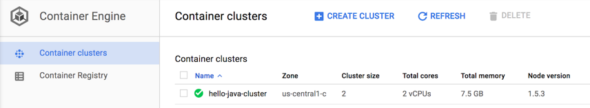

# Spring Boot app to GCP GKE

<!-- https://codelabs.developers.google.com/codelabs/cloud-springboot-kubernetes#0 -->

If you're interested in running Kubernetes on your local machine, such as a development laptop, then look into Minikube, which offers a simple setup of a single-node Kubernetes cluster for development and testing purposes.

TOC

## Setup and requirements

Run the following command in Cloud Shell to confirm that you are authenticated:

`gcloud auth list`

## Get source code

```dos
git clone https://github.com/spring-guides/gs-spring-boot.git
cd gs-spring-boot/complete
```

## Locally run the app

You can start the Spring Boot app normally with the Spring Boot plugin.

`$ ./mvnw -DskipTests spring-boot:run`

After the app starts, click on Web Preview 396bfd51f55afb5d.pngin the Cloud Shell toolbar and select Preview on port 8080.


A tab in your browser opens and connects to the server you just started.


## Package the Java app as a Docker container

Next, you need to prepare your app to run on Kubernetes. The first step is to define the container and its contents.

1. Create the JAR deployable for the app.

`$ ./mvnw -DskipTests package`

2. Enable Container Registry to store the container image that you'll create.

`$ gcloud services enable containerregistry.googleapis.com`

3. Use Jib to create the container image and push it to the Container Registry.

```dos
$ export GOOGLE_CLOUD_PROJECT=`gcloud config list --format="value(core.project)"`

$ ./mvnw -DskipTests com.google.cloud.tools:jib-maven-plugin:build \
  -Dimage=gcr.io/$GOOGLE_CLOUD_PROJECT/hello-java:v1
```

4. You should be able to see the container image listed in the console by navigating to the Container Registry Images page in the Cloud Console. You now have a project-wide Docker image available, which Kubernetes can access and orchestrate as you'll see in a few minutes.

Note: While you used a generic domain for the registry (gcr.io), you can also be more specific about which zone and bucket to use. For more information, see Container Registry documentation.

5. (Optional) After completion (it'll take some time to download and extract everything), test the image with the following command, which will run a Docker container as a daemon on port 8080 from your newly created container image:

`$ docker run -ti --rm -p 8080:8080 gcr.io/$GOOGLE_CLOUD_PROJECT/hello-java:v1`

Again, take advantage of the web preview feature of Cloud Shell.


You should see the default page in a new tab. After you verify that the app is locally running in a Docker container, you can stop the running container by pressing Control+C.

## Create your cluster

You're ready to create your GKE cluster. A cluster consists of a Kubernetes API server managed by Google and a set of worker nodes. The worker nodes are Compute Engine VMs.

1. First, make sure that the related API features are enabled.

```dos
$ gcloud services enable compute.googleapis.com container.googleapis.com
Operation "operations/..." finished successfully
```

2. Create a cluster with two n1-standard-1 nodes (it will take a few minutes to complete).

```dos
$ gcloud container clusters create hello-java-cluster \
  --num-nodes 2 \
  --machine-type n1-standard-1 \
  --zone us-central1-c
```

In the end, you should see the cluster created.

```dos
Creating cluster hello-java-cluster...done.
Created [https://container.googleapis.com/v1/projects/...].
kubeconfig entry generated for hello-dotnet-cluster.
NAME                  ZONE            MASTER_VERSION  
hello-java-cluster  us-central1-c  ...
```

Note: Alternatively, you could create the cluster in the Cloud Console. To get there, click Navigation menu > Kubernetes Engine > Clusters > Create cluster. You can create a cluster in another zone, but it is recommended to stay in the same region as the storage bucket used by Container Registry.

You should now have a fully functioning Kubernetes cluster powered by GKE.



It's now time to deploy your containerized app to the Kubernetes cluster! From now on, you'll use the kubectl command line (already set up in your Cloud Shell environment). The rest of the codelab requires the Kubernetes client and server version to be 1.2 or higher. kubectl version will show you the current version of the command.

## Deploy your app to Kubernetes

1. A Kubernetes deployment can create, manage, and scale multiple instances of your app using the container image that you created. Deploy one instance of your app to Kubernetes using the `kubectl run` command.

```dos
$ kubectl create deployment hello-java \
  --image=gcr.io/$GOOGLE_CLOUD_PROJECT/hello-java:v1
```

2. To view the deployment that you created, simply run the following command:

```dos
$ kubectl get deployments
NAME         DESIRED   CURRENT   UP-TO-DATE   AVAILABLE   AGE
hello-java   1         1         1            1           37s
```

3. To view the app instances created by the deployment, run the following command:

```dos
$ kubectl get pods
NAME                         READY     STATUS    RESTARTS   AGE
hello-java-714049816-ztzrb   1/1       Running   0          57s
```

At this point, you should have your container running under the control of Kubernetes, but you still have to make it accessible to the outside world.

## Allow external traffic

By default, the Pod is only accessible by its internal IP within the cluster. In order to make the `hello-java` container accessible from outside the Kubernetes virtual network, you have to expose the Pod as a Kubernetes service.

1. In Cloud Shell, you can expose the Pod to the public internet by creating a Kubernetes LoadBalancer service.

`$ kubectl create service loadbalancer hello-java --tcp=8080:8080`

Note that you directly expose the deployment, not the Pod. That will cause the resulting service to load balance traffic across all Pods managed by the deployment (in this case, only one Pod, but you'll add more replicas later).

The Kubernetes Master creates the load balancer and related Compute Engine forwarding rules, target pools, and firewall rules to make the service fully accessible from outside of Google Cloud.

2. To find the publicly accessible IP address of the service, simply request `kubectl` to list all the cluster services.

```dos
$ kubectl get services
NAME         CLUSTER-IP     EXTERNAL-IP      PORT(S)    AGE
Hello-java   10.3.253.62    aaa.bbb.ccc.ddd  8080/TCP    1m
kubernetes   10.3.240.1     <none>           443/TCP    5m
```

Note: The EXTERNAL-IP may take several minutes to become available and visible. If the EXTERNAL-IP is missing, then wait a few minutes and try again.

3. You should now be able to reach the service by pointing your browser to <<<<<<http://<EXTERNAL_IP>:8080>>>>>>. In the example, the external IP address is `aaa.bbb.ccc.ddd`.

## Scale your service

One of the powerful features offered by Kubernetes is how easy it is to scale your app. Suppose that you suddenly need more capacity for your app. You can simply tell the replication controller to manage a new number of replicas for your app instances.

```dos
$ kubectl scale deployment hello-java --replicas=3
deployment "hello-java" scaled

$ kubectl get deployment
NAME         DESIRED   CURRENT   UP-TO-DATE   AVAILABLE   AGE
hello-java   3         3         3            3           22m
```

Notice the declarative approach. Rather than starting or stopping new instances, you declare how many instances should be running at all times. Kubernetes reconciliation loops simply make sure that the reality matches what you requested and takes action, if needed.

## Roll out an upgrade to your service

At some point, the app that you deployed to production will require bug fixes or additional features. Kubernetes can help you deploy a new version to production without impacting your users.

1. Open the code editor by clicking Launch editor 26e896774198a7b9.pngin the Cloud Shell menu.

2. Navigate to `src/main/java/com/example/springboot/HelloController.java` and update the value of the response.

```java
package com.example.springboot;

import org.springframework.web.bind.annotation.RestController;
import org.springframework.web.bind.annotation.RequestMapping;

@RestController
public class HelloController {

    @RequestMapping("/")
    public String index() {
        return "Greetings from Google Kubernetes Engine!";
    }
}
```

3. Use Jib to build and push a new version of the container image. Building and pushing the updated image should be much quicker as you take full advantage of caching.

```dos
$ ./mvnw -DskipTests package \
  com.google.cloud.tools:jib-maven-plugin:build \
  -Dimage=gcr.io/$GOOGLE_CLOUD_PROJECT/hello-java:v2
```

You're ready for Kubernetes to smoothly update your replication controller to the new version of the app!

4. In order to change the image label for your running container, you need to edit the existing `hello-java` deployment and change the image from `gcr.io/PROJECT_ID/hello-java:v1` to `gcr.io/PROJECT_ID/hello-java:v2`.

5. You can use the kubectl set image command to ask Kubernetes to deploy the new version of your app across the entire cluster one instance at a time with rolling updates.

```dos
$ kubectl set image deployment/hello-java \
  hello-java=gcr.io/$GOOGLE_CLOUD_PROJECT/hello-java:v2

deployment "hello-java" image updated
```

Note: While that's happening, the users of the services might experience interruptions, but that's because there was no health check configured. That's a slightly more advanced configuration that's beyond the scope of the codelab.

(Configure Liveness, Readiness and Startup Probes)

6. Check <http://EXTERNAL_IP:8080> again to see that it's returning the new response.

## Roll back

Oops! Did you make a mistake with a new version of the app? Perhaps the new version contained an error and you need to quickly roll it back. With Kubernetes, you can roll it back to the previous state easily. Roll back the app by running the following command:

`$ kubectl rollout undo deployment/hello-java`

## Clean up if needed

```dos
$ gcloud container clusters delete hello-java-cluster --zone us-central1-c

$ gcloud container images delete \
  gcr.io/$GOOGLE_CLOUD_PROJECT/hello-java:v1 \
  gcr.io/$GOOGLE_CLOUD_PROJECT/hello-java:v2
```
