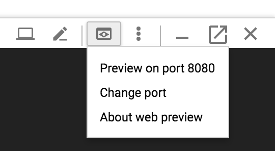
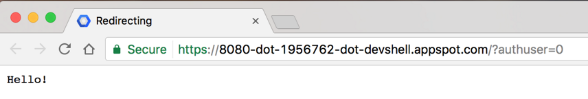

# Spring Boot app to GCP GKE

<!-- https://codelabs.developers.google.com/codelabs/cloud-springboot-kubernetes#0 -->

If you're interested in running Kubernetes on your local machine, such as a development laptop, then look into Minikube, which offers a simple setup of a single-node Kubernetes cluster for development and testing purposes.

TOC

## Setup and requirements

Run the following command in Cloud Shell to confirm that you are authenticated:

`gcloud auth list`

## Get source code

```dos
git clone https://github.com/spring-guides/gs-spring-boot.git
cd gs-spring-boot/complete
```

## Locally run the app

You can start the Spring Boot app normally with the Spring Boot plugin.

`$ ./mvnw -DskipTests spring-boot:run`

After the app starts, click on Web Preview 396bfd51f55afb5d.pngin the Cloud Shell toolbar and select Preview on port 8080.



A tab in your browser opens and connects to the server you just started.



## Package the Java app as a Docker container

Next, you need to prepare your app to run on Kubernetes. The first step is to define the container and its contents.

1. Create the JAR deployable for the app.

`$ ./mvnw -DskipTests package`

2. Enable Container Registry to store the container image that you'll create.

`$ gcloud services enable containerregistry.googleapis.com`

3. Use Jib to create the container image and push it to the Container Registry.

```dos
$ export GOOGLE_CLOUD_PROJECT=`gcloud config list --format="value(core.project)"`

$ ./mvnw -DskipTests com.google.cloud.tools:jib-maven-plugin:build \
  -Dimage=gcr.io/$GOOGLE_CLOUD_PROJECT/hello-java:v1
```

4. You should be able to see the container image listed in the console by navigating to the Container Registry Images page in the Cloud Console. You now have a project-wide Docker image available, which Kubernetes can access and orchestrate as you'll see in a few minutes.

Note: While you used a generic domain for the registry (gcr.io), you can also be more specific about which zone and bucket to use. For more information, see Container Registry documentation.

5. (Optional) After completion (it'll take some time to download and extract everything), test the image with the following command, which will run a Docker container as a daemon on port 8080 from your newly created container image:

`$ docker run -ti --rm -p 8080:8080 gcr.io/$GOOGLE_CLOUD_PROJECT/hello-java:v1`

Again, take advantage of the web preview feature of Cloud Shell.


You should see the default page in a new tab. After you verify that the app is locally running in a Docker container, you can stop the running container by pressing Control+C.
