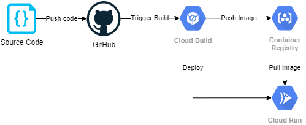

# MyGCP

My GCP

## My GCP projects

```text
When I worked for ..., I worked on many projects with GCP, including the following:
- Deploying Java Applications on Google Kubernetes Engine (GKE): I successfully deployed Java applications onto GKE, leveraging Kubernetes to manage containerized workloads efficiently. This involved configuring deployment strategies, managing resources, and ensuring high availability and scalability.
- Scaling Applications with GKE: I actively participated in scaling applications up and down based on demand using GKE's autoscaling capabilities. This involved monitoring application performance metrics and adjusting resource allocations accordingly to optimize cost and performance.
- Containerization with Docker and Kubernetes: I containerized applications using Docker images and managed them effectively using Kubernetes. This allowed for consistent deployment across environments and simplified the management of dependencies and configurations.
- Utilizing Pub/Sub for Message Management: I leveraged Google Cloud Pub/Sub to implement messaging solutions for asynchronous communication between components of distributed systems. This involved designing message schemas, managing subscriptions, and ensuring reliable message delivery.
- Infrastructure as Code with Terraform: I used Terraform to define and provision infrastructure resources on GCP in a repeatable and automated manner. This included defining infrastructure components such as virtual machines, networks, and storage resources using Terraform configurations.
- Data Management with BigQuery and Cloud Storage (GCS): I utilized BigQuery for storing and querying large-scale datasets, enabling efficient data analysis and insights generation. Additionally, I managed data storage requirements using GCS buckets, implementing best practices for data lifecycle management and access control.
- VPN Configuration and Management: I configured virtual private networks (VPNs) on GCP to establish secure connections between on-premises infrastructure and GCP resources. This involved designing network topologies, configuring VPN gateways, and ensuring secure data transmission.
- Virtual Machine (VM) Management: I managed virtual machine instances on GCP, provisioning and configuring VMs to meet application requirements. This included optimizing VM performance, monitoring resource utilization, and implementing automated backups and disaster recovery strategies.
- Data and Application Migration: I designed and implemented data migration strategies to transfer large volumes of data to GCP, ensuring minimal downtime and data integrity. Additionally, I facilitated the migration of applications to GCP, optimizing architecture and configurations for cloud-native environments.
```

### Project 18

GitLab CI/CD pipeline with BigQuery and GCS

- Data owners create the merge request

- GitLab pipeline got trigered by the merge requests

- Data Goverence guys approve / reject the merge request

- GitLab pipeline take the incoming the csv / json files and reload BiqQuery tables

- Then archive to GCS buckets in Arvo format

### Project 17

Dataflow ingestion from Oracle to BigQuery

- cx_Oracle -> oracledb

- Oracle instant client in Linux

- Apache Beam

- DirectRunner

- DataflowRunner

- Self contaoiner

- SubNetwork

- setup.py with custom commands

- requirements.txt

- Dockerfile + YAML

- custom container/image

- Cloud Build

- Dataflow Template with Options (can clone the job easily)

- Secert Manager

- Private IPs

- Sub network

- setup.py

### Project 16

Malware Scanner pipeline

- clamAV open source node.js app

- Customize and tweak to handle large files

- GCS buckets

- Containerize / dockerize

- Created lots of snow requests to resolve access and permission issues

- Cloud build / Triggers

- Cloud Run

- BitBuckets

- Terraform
  
### Project 15

PubSub topic with Cloud Function in Python

- schema

- topic

- subscription

- google API

- rest API

- Postman

- base64 encoding

- cloud function

- Terraform

### Project 14

Designed, developed, deployed and managed Microservices with Node.js and Java RESTful APIs in GCP for a large Telecommunication company

- Built new REST APIs with Node.js and Java to talk with downstream APIs and serve for upstream applications.
- Leveraged Redis to provide caching and programmed the refresh schedule jobs (bulk deleting hash and set keys).
- Mocked APIs with Mockoon and nock during the development.
- Automated the build and test processes with GitHub repo, triggers, schedulers and Cloud Builds.
- Deployed with Cloud build YAML files, GKE Kubernetes, pods, Helm and Docker file to achieve auto scaling.
- Implemented CI/CD pipelines with Spinnaker, Jenkins, Groovy and Terraform.
- Monitored API performance with Google Cloud stack driver dashboard and alert policies.
- Implemented immutable infrasture with Terraform scripts and pull requests.
- Conducted performance testing with JMeter.
- Protected sensitive data with DLP API, Cloud Function and Pub/Sub.
- Mitigated DDoS threats with Cloud Armor.
- Identified vulnerabilities in the App Engine with Security Scanner.

### Project 13

Designed and implemented Cloud functions and CI/CD data pipelines in Google Cloud for a large multinational company

- Programmed cloud functions in Golang and Python.
- Configured one cloud function to monitor incoming Pub/Sub messages then save to BigQuery, another cloud function to archive data from BigQuery to GCS bucket in avro format with Cloud Schedule.
- Created unit tests with mock and integration tests for test coverage;
- Built a stress testing multi-threading tool for performance benchmark and adjusted Cloud Function configuration.
- Managed all GCP infrastructure as code with Terraform scripts, parameterized all cloud functions, automated everything and enabled auto-scaling.
- Designed and built the CI/CD pipelines with Cloud Source Repository, Cloud Build and GCP Container Registry with Docker and YAML; set up the triggers for the test pipelines and prod pipeline; configured multiple test pipelines can run concurrently.
- Worked on Dataflow pipelines with Apache Beam SDK for Java and Maven.
- Handed over high quality detailed runbook documentation

### Project 12
  
Designed solutions to migrate on premise applications to GCP for a large pharmacy client

- Discussed with business owners and other vendors to plan the detailed runbook and matrices in both high level and low level.
- Moved all Informatica applications (MDM, WildFly, EDC, IDQ, AXON) from on premise to Cloud (OpenShift and Google Cloud Platform) and NoSQL BigQuery migration.

- Created many Data Science and Machine Learning POCs with GCP Machine Learning APIs (NLP, Cloud Vision, DialogFlow etc.), Jupyter Notebook and Python.

### Project 11

Designed, developed, deployed and managed Microservices Java RESTful APIs to OpenShift and GCP for a large telecommunication company

- Used Stoplight studio to design new APIs (OAS 2 & 3 YAML) and upgrade the old SOAP web services (with WebLogic) to RESTful with Java, Spring Boot and Maven.
- For a new REST API project, used Kotlin and Gradle to develop the APIs, and Terraform, Docker and Spinnaker to build the pipelines and deploy to GCP.
- Created the old and new API mapping document for upstream callers; composed the downstream APIs for internal usage; designed API changes to work with external vendors and downstream providers.
- Utilized Swagger Editor and Swagger Maven plugin to create Java client classes.
- Implemented Application Gateway BFF pattern to onboard new APIs and used OAuth2 tokens and scopes on enhance the security controls.
- Built the front end applications with Angular, HTML5 and CSS 3; used code validators to validate all HTML to ensure WCAG 2.0 standard were followed.
- Managed source file version control with Azure Repos; managed cloud-based identity and access management (IAM) with Azure AD.
- Used Tekton and Jenkins to build CI/CD OpenShift pipelines with Git Azure DevOps.
- Managed Microservices Java Spring Boot applications with RedHat OpenShift; Configured OpenShift to auto-scaling (up and down as needed).
- Created Helm charts to manage Kubernetes resources and deploy applications in OpenShift; Updated and rolled back packages to control new versions.
- Used Service Discovery and Load Balancing to split traffics for A/B testing, Blue/Green and Canary deployments.
- Monitored applications with Prometheus graphs and Grafana dashboards.
- Planned architecture changes for moving everything to Google Cloud Platform, such as migrating Oracle to NoSQL BigQuery.
- Documented everything in the share drive for knowledge sharing.

## My GCP Solutions

[My GCP Solutions](GCP_Solutions.md)

## GCE vs GKE vs GAE vs GCF

Google Cloud Platform (GCP) offers multiple services like Google Compute Engine (GCE), Google Kubernetes Engine (formerly Container Engine) (GKE), Google App Engine (GAE) and Google Cloud Functions (GCF).

## Firebase

[GCP Firebase](GCP_Firebase.md)

## Google Kubernetes Engine (aka GKE)

[GCP GKE](GCP_GKE.md)

## Cloud Run

[GCP Cloud Run](GCP_CloudRun.md)

## GCP Cloud SQL

[GCP Cloud SQL](GCP_CloudSQL.md)

## GCP Architect

[GCP Architect](GCP_Architect.md)

## GCP CI/CD pipeline



- Developer checks in the source code to a Version Control system such as GitHub
- GitHub triggers a post-commit hook to Cloud Build.
- Cloud Build builds the container image and pushes to Container Registry.
- Cloud Build then notifies Cloud Run to redeploy
- Cloud Run pulls the latest image from the Container Registry and runs it.

## Cloud Build

[GCP_CloudBuild](GCP_CloudBuild.md)

## GCP BigQuery

[GCP BigQuery](GCP_BigQuery.md)

## GCP networks

Troubleshooted lots of network / firewall / connectivity issues in my GCP projects.

[GCP_Network](GCP_Network.md)

## Dataflow jobs

Java

Python

Cloud Build

YAML

[GCP_Dataflow](GCP_Dataflow.md)

## Eventarc + Cloud Run + Workflow + Secret Manager

These are new tools and solutions for new projects.

### Some use cases

For the text files uploaded to GCP buckets, use Eventarc + Cloud Run + Workflow + OpenSource Clam to scan and verify if they are safe.

For the images uploaded to GCP buckets, use Eventarc + Cloud Run + Workflow + Vision API to scan and verify if they are safe.

## Lab, exercises and practice

- Hands-on labs with Qwiklabs.

## CBTNuggets GCP Fundamentals

[CBTNuggets GCP Fundamentals](CBTNuggets-gcp-fundamentals/README.md)
