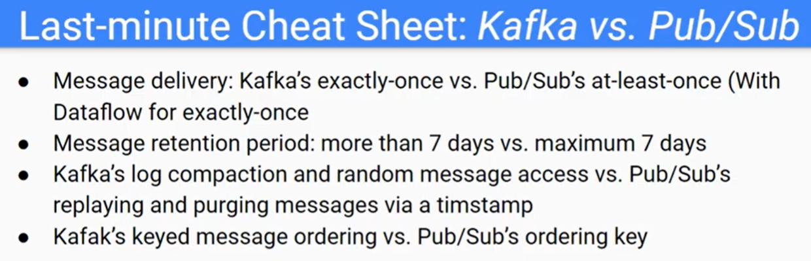

# MyGCP

My GCP

## My Experience / My GCP projects

- Designed, developed, deployed and managed Microservices with Node.js and Java RESTful APIs in GCP for a large Telecommunication company
    - Built new REST APIs with Node.js and Java to talk with downstream APIs and serve for upstream applications.
    - Leveraged Redis to provide caching and programmed the refresh schedule jobs (bulk deleting hash and set keys).
    - Mocked APIs with Mockoon and nock during the development.
    - Automated the build and test processes with GitHub repo, triggers, schedulers and Cloud Builds.
    - Deployed with Cloud build YAML files, GKE Kubernetes, pods, Helm and Docker file to achieve auto scaling.
    - Implemented CI/CD pipelines with Spinnaker, Jenkins, Groovy and Terraform.
    - Monitored API performance with Google Cloud stack driver dashboard and alert policies.
    - Implemented immutable infrasture with Terraform scripts and pull requests.
    - Conducted performance testing with JMeter.
    - Protected sensitive data with DLP API, Cloud Function and Pub/Sub.
    - Mitigated DDoS threats with Cloud Armor.
    - Identified vulnerabilities in the App Engine with Security Scanner.

- Designed and implemented Cloud functions and CI/CD data pipelines in Google Cloud for a large multinational company
    - Programmed cloud functions in Golang and Python.
    - Configured one cloud function to monitor incoming Pub/Sub messages then save to BigQuery, another cloud function to archive data from BigQuery to GCS bucket in avro format with Cloud Schedule.
    - Created unit tests with mock and integration tests for test coverage; 
    - Built a stress testing multi-threading tool for performance benchmark and adjusted Cloud Function configuration.
    - Managed all GCP infrastructure as code with Terraform scripts, parameterized all cloud functions, automated everything and enabled auto-scaling.
    - Designed and built the CI/CD pipelines with Cloud Source Repository, Cloud Build and GCP Container Registry with Docker and YAML; set up the triggers for the test pipelines and prod pipeline; configured multiple test pipelines can run concurrently.
    - Worked on Dataflow pipelines with Apache Beam SDK for Java and Maven.
    - Handed over high quality detailed runbook documentation

- Designed solutions to migrate on premise applications to GCP for a large pharmacy client
    - Discussed with business owners and other vendors to plan the detailed runbook and matrices in both high level and low level.
    - Moved all Informatica applications (MDM, WildFly, EDC, IDQ, AXON) from on premise to Cloud (OpenShift and Google Cloud Platform) and NoSQL BigQuery migration.

- Created many Data Science and Machine Learning POCs with GCP Machine Learning APIs (NLP, Cloud Vision, DialogFlow etc.), Jupyter Notebook and Python.

Exercises and practice:

- Hands-on labs with Qwiklabs.

## GCE GKE GAE GCF

Google Cloud Platform (GCP) offers multiple services like Google Compute Engine (GCE), Google Kubernetes Engine (formerly Container Engine) (GKE), Google App Engine (GAE) and Google Cloud Functions (GCF). 

## GCP Architect

Dataproc vs Dataflow

Kafka vs PubSub

IAM best practice

Cloud KMS

## My iw

https://bespinglobal.freshteam.com/assessments/zYqzLbG6Ll9W

https://meet.google.com/jfy-iepw-vbo

